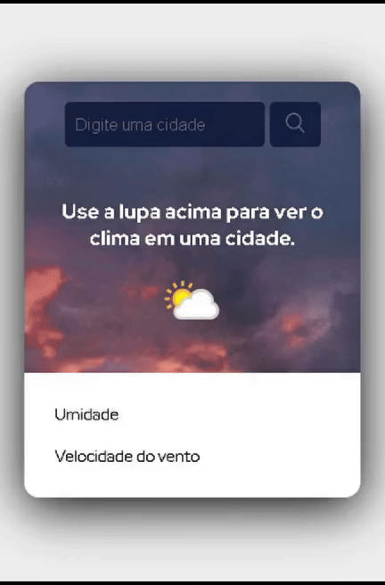

# Front-Clima

Este é um projeto front-end que permite visualizar condições do clima de acordo com a cidade consultada utilizando os serviços da api pública 'Weather API' que pode ser acessa através do link https://www.weatherapi.com/weather/

## Funcionalidades

Ao digitar o nome de uma cidade no campo correspondente e clicar no botão com ícone de lupa, a aplicação retorna os seguinte dados referente ao clima atual da cidade informada:

- Cidade;
- Região/Estado;
- Temperatura em Graus Celsius;
- Ícone que ilustra a condição do clima;
- Descrição da condição;
- Umidade; e
- Velocidade do vento.

## Tecnologias
- **HTML5**: Para marcação da página.
- **CSS**: Para estilização da página.
- **JavaScript**: Para adcionar funcionalidade à pagina.

## Como utilizar:

### Primeira versão do projeto:

Passos utilização dessa API é necessário gerar uma chave de autenticação. Segue abaixo passos para autenticação:

1- Se cadastre no site através do link https://www.weatherapi.com/signup.aspx

2- Realize a confirmação de cadastro através de link enviado por email e realize login pelo site.

3- Ao ser direcionado para o seu perfil (https://www.weatherapi.com/my/), é possível visualizar o campo API Key que contém o valor da chave a ser utilizada na autenticação, copie o valor desse campo.

4- Para utilizar em ambiente local, acesse o arquivo 'index.js' disponibilizado no caminho 'src\js' desse projeto e na linha 7, insira entre as aspas o valor copiado. Por fim, salve as alterações realizadas.

5- Realize a abertura do arquivo 'index.html', disponível no diretório 'src', para visualizar e utilizar a aplicação.

### Segunda (e atual) versão do projeto:

A partir do commit 30788ef de data 25/11/2024, a aplicação Front-end deixou de apontar diretamente para a API pública Weatherapi e passou a ter seus serviços fornecidos pela api própria construída em C# ASP.NET, onde a última citada é quem faz o consumo dos serviços da API pública. Por esse motivo, a variável 'chaveApi' que recebia a chave da API publica deixou de estar inclusa no arquivo index.js desse projeto. A geração da chave para consumo da API pública ainda se faz necessária, no entanto, o seu valor agora deve ser adicionado à constante 'ApiKey' representada na linha 9 do arquivo ClimaRepository do projeto back-end 'Api-Clima'.

Consulte o projeto back-end [Api-Clima](https://github.com/joicereis/Api-Clima).

